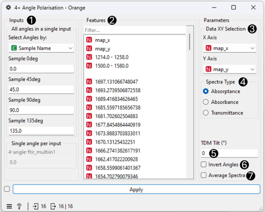
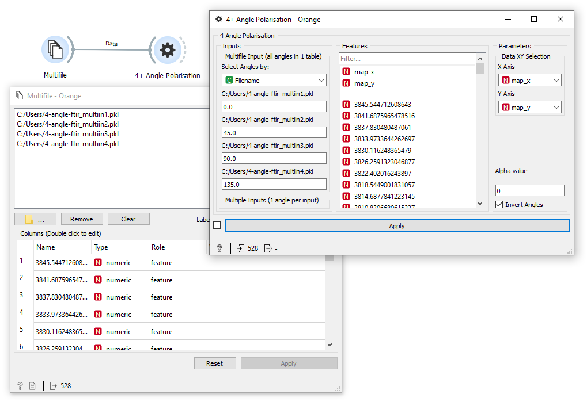

4+ Angle Polarisation
============

Calculates vibrational mode orientation from polarised datasets

**Inputs**

- Data: input dataset(s)

**Outputs**

- Polar Data: dataset with selected feature(s) orientation information
- Curve Fit Model Data: dataset with the optimal parameters of the curve fit model

The **4+ Angle Polarisation** widget allows you to calculate orientation information of selected features using polarised spectroscopy data collected at 4 or more polarisation angles. The implemented algorithm is the same as that outlined by Hikima et. al. (2013)1

1. Inputs: Define the polarisation angles of the input dataset. Data can be passed to widget with two methods:
    - *Multifile Input*: A single input with data from all polarisation angles in a single dataset. (Each polarisation angle must be separated with a categorical variable).
    - *Multiple Inputs*: 1 input per polarisation angle.
2. Features: Select the features to calculate the orientation of.
3. Data XY Selection: Define the attributes for the x and y axes for 2D datasets.
4. Alpha value: The value (α) to use when calculating Herman's orientation function .
5. Invert Angles: Invert the calculated Azimuth Angles about the 0 degree axis (i.e. so that 90 degrees is output as -90 degrees).

Input Examples
-------
MultiFile Input

Multiple Inputs

1. Hikima, Y.;  Morikawa, J.; Hashimoto, T., Wavenumber Dependence of FT-IR Image of Molecular Orientation in Banded Spherulites of Poly(3-hydroxybutyrate) and Poly(L-lactic acid). Macromolecules 2013, 46, 1582-1590.
