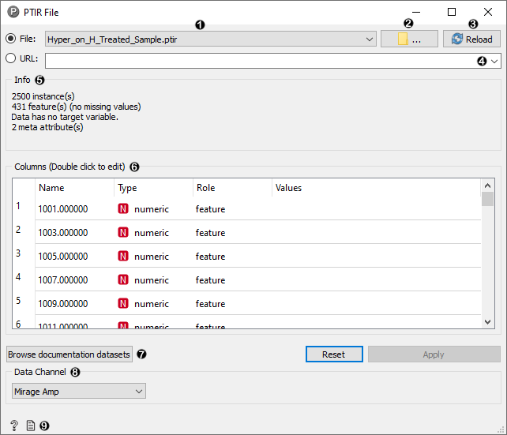

PTIR File
=========

Read spectral data from input PTIR file, select a data channel, and send the dataset to the output.

**Outputs**

 - Data: dataset from the selected channel read from the input file

The **PTIR File** widgets loads data from .ptir files. After loading a file, the data channel drop-down will
present available data channels to select. Selecting a different data channel will re-load the data output.

1. Browse through previously opened data files.
2. Browse for a data file.
3. Reloads the currently selected data file.
4. Insert data from URL addresses.
5. Information on the dataset: dataset size, number and types of data features.
6. Additional information on the features in the dataset. Features can be edited by double-clicking on
them. PTIR files list each wavenumber as a feature, and additional "map_x" and "map_y" meta
attributes are created to describe the x and y axes for hyperspectral data.
7. Browse documentation datasets.
8. Select a data channel to load.
9. Produce a report.
